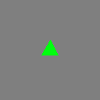
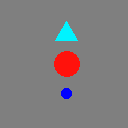
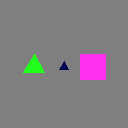
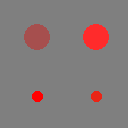
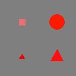
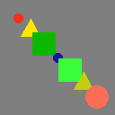
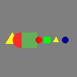

# Generator for tutored learning
## Description

This library implements our tutored learning (temporary name) approach described in the paper XXX.

Humans can learn effortlessly new concepts from limited examples, on the other hand neural networks struggle when presented with limited examples and when they are required to compose previously acquired knowledge into new concepts.
We argue that one of the reasons of these limitations is the radically different learning regimes to which humans and neural networks are subject to.

Human education is heavily reliant on teachers "scheduling" concept difficulties in a way which elicits correct chains of thoughts and associations, and capable of presenting "old concepts" whenever they are deemed useful for the current task.
Moreover, as the student gets more confident with its answers, a teacher gradually reduces supervision, promoting a more independent decision making process.

This code presents samples from a sequence of tasks in a non i.i.d. fashion, by emulating a teacher's behavior on a sequence of contrastive tasks.
Tasks are two sets of symbolic rules defined on a simple geometric domain and the neural network is provided with an image, with the objective of determining whether the input belongs to the positive or negative set.
The teacher can decide to present unsupervised samples or supervised triplets `(anchor, positive, negative)` belonging to the current task or any of the previously shown tasks, according to a schedule.

The schedule is governed by an exponential distribution providing maximum supervision at the beginning of each task and minimum at the end.
A geometric distribution determines whether a sample coming from an old task should be presented, with probability decreasing the farther in time the old task is.
This schedule emulates, for example, the behavior of a math teacher presenting topics from counting to differential equations, sorted in the way eliciting the best learning process, and "refreshing" relevant content (eg. when explaining quadratic equations it is useful to refresh linear equations with an higher probability than refreshing multiplication tables).

The code provides a way to define curricula in JSON format and a generator which can be queried both for traditional datasets (for i.i.d. training or testing) and tutored samples generated one at the time.

Each task image contains base concepts (triangles, squares and circles, in 6 different colors and 2 different sizes), which can be composed spatially by these recursive operators:
- `in`: subconcepts are drawn one inside the other
- `random`: subconcepts are drawn at random positions
- `stack`: subconcepts are drawn top-to-bottom
- `side_by_side`: subconcepts are drawn left-to-right
- `diagonal_ul_lr`: subconcepts are drawn diagonally, from the upper left corner to the lower right
- `diagonal_ll_ur`: subconcepts are drawn diagonally, from the lower left corner to the upper right
- `grid`: subconcepts are arranged in a square grid, left-to-right, top-to-bottom

Spatial compositions can be arbitrarily complex, however, as the available space for each level decreases exponentially, there is a practical limit after which (small) images get overcrowded.

Top level concepts are implicitly disjunctive, allowing for complex tasks such as discriminating between "three red circles arranged diagonally, or three blue squares arranged vertically" (positive set) versus "three blue squares arranged diagonally, or three red circles arranged vertically" (negative set).

To maximize experimental robustness, two mechanisms are enforced:
- A random seed can be specified in the configuration file.
- If a task has enough samples, all possible combinations are expanded into disjoint train, validation and test sets.

(This latter mechanism may require huge amounts of memory, so it can be disabled by setting `"try_disjoint_splits": false` in the configuration file.)

**All the tasks are assumed to be Bongard-like, ie. a binary decision determining whether an image belongs to a positive or negative set.**

## Examples

| Task description                 | Positive example                       | Negative example                           |
|----------------------------------|----------------------------------------|--------------------------------------------|
| The image contains a triangle    |      |      |
| Objects are arranged vertically  |      |      |
| Shapes are all the same          |              |              |
| Shapes form a palindrome         |  |  |

## Requirements
```
logging
numpy
colorsys
pillow
```

## Usage

1. Generate a JSON configuration (see `commented_config.js` for the grammar).
2. Generate a JSON curriculum (see `commented_curriculum.js` for the grammar).
3. Create a teacher:
    ```python
   with open("config.json", "r") as file:
        config = file.read()
   
    with open("curriculum.json", "r") as file:
        curriculum = file.read()

    cg = CurriculumGenerator(config, curriculum, logger)
   # Logger is an optional instance of logging for debug purposes.
   ```
4. Use the teacher:
   - As i.i.d. supervised dataset:
     ```python
     for i in range(len(cg.tasks)):
        for j in range(num_batches):
            batch = cg.get_batch(i, batch_size, split)
            # batch is a list of tuples ((anchor_image, anchor_symbol), (positive_image, positive_symbol), (negative_image, negative_symbol))
            # split is None/"train"/"val"/"test". If config["try_disjoint_splits"] is false or the set cardinality is too small, this does not matter.
            use(batch)
     ```
   - As tutor generator:
    ```python
    for (task_id, anchor, positive, negative) in cg.generate_curriculum(split, batch_size):
        # task_id is the id of the task which generated a particular sample. 
        # anchor is the anchor image, if unsupervised it can either be positive or negative.
        # positive and negative are None if the sample is unsupervised, otherwise they are the images (and anchor is guaranteed to be positive).
        use(task_id, anchor, positive, negative)
    ```
   - As i.i.d. shuffled tutor generator:
    ```python
    for (task_id, anchor, positive, negative) in cg.generate_shuffled_curriculum(split, batch_size):
        # task_id is the id of the task which generated a particular sample. 
        # anchor is the anchor image, if unsupervised it can either be positive or negative.
        # positive and negative are None if the sample is unsupervised, otherwise they are the images (and anchor is guaranteed to be positive).
        use(task_id, anchor, positive, negative)
    ```
   Note: Discard `task_id` for continual learning applications where it is unrealistic to know task progression.

## License

This project is under the Beerware license.

As long as you retain this notice you can do whatever you want with this stuff. If we meet some day, and you think this stuff is worth it, you can buy me a beer in return.